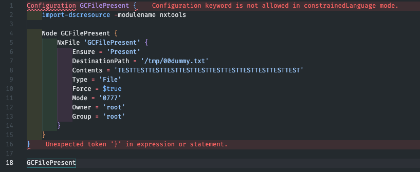

# Azure Policy Guest Configuration for Linux - Part 1

I'm currently checking out [:octicons-link-external-16: Azure Policy Guest Configuration for Linux VMs](https://learn.microsoft.com/en-us/azure/governance/machine-configuration/) and will note down my progress made here. The whole process took me a while to understand, also I haven't used DSC before. Learning on the fly!


## Objectives

- Audit that a user is present on the system
- Audit that a file with specific content is present in a specific path
- Audit that a service is running
- Continuous remediation of non-compliant systems
<!-- more -->
Everything is available in this Github repo: [:simple-github: https://github.com/joxz/guestconfiguration-linux](https://github.com/joxz/guestconfiguration-linux)


!!! abstract "Notes"
    - The name is now changing to Azure Automanage Machine Configuration
    - Most documentations show Windows configurations which seem easier to achieve, I'll take a look at those later
    - Predefined Linux DSC resources seem limited, might need to check out how to develop those myself
    - For Linux VMs it's also possible to use Chef InSpec instead of DSC

## Prerequisites for Guest Configuration

- [x] Azure Linux VM with supported OS[^5]
- [x] System-assigned managed identity enabled on the VM
- [x] VM extension `AzurePolicyforLinux` installed[^1]

## Dev Environment

Due to the `GuestConfiguration` powershell module only being available for Ubuntu 18.04[^6], a [:octicons-link-external-16: dev container](https://code.visualstudio.com/docs/devcontainers/containers) for vscode is an easy solution to set up a proper dev environment to author guest configuration policies.

Please check requirements for this feature on the vscode page. Another solution could for example be to use a [:octicons-link-external-16: VS Code Server](https://code.visualstudio.com/docs/remote/vscode-server) and [:octicons-link-external-16: Remote Tunnels](https://code.visualstudio.com/docs/remote/tunnels) on a dev server. VSCode luckily offers a lot of solutions!

### Dev Container Image

The docker image uses Powershell 7.2 LTS, Ubuntu 18.04 as OS and installs the module `PSDesiredStateConfiguration` in version `3.0.0-beta1` which is needed to author guestconfiguration policies for Linux [^2]

Some additional packages are installed as devcontainer features[^3]:

- Oh-my-ZSH
- VSCode Powershell extension 
- Git
- Azure CLI

### Dev Container Setup

- Clone the repo or [:simple-github: copy](https://github.com/joxz/guestconfiguration-linux/tree/main/.devcontainer) `devcontainer.json` and `Dockerfile` to directory `.devcontainer`
- Install `devcontainer CLI` in vscode [:octicons-link-external-16:  https://code.visualstudio.com/docs/devcontainers/devcontainer-cli](https://code.visualstudio.com/docs/devcontainers/devcontainer-cli)
- Run `devcontainer build` to build the container
- Run `devcontainer up` to start the container
- Run `devcontainer open` to open vscode in the newly created dev environment

Version Outputs:

```pwsh
PS /workspaces/guestconfiguration-linux/guestconfiguration> Get-nxDistributionInfo                                      

VERSION             : 18.04.6 LTS (Bionic Beaver)
ID                  : ubuntu
DISTRIB_ID          : Ubuntu
VERSION_ID          : 18.04
NAME                : Ubuntu

PS /workspaces/guestconfiguration-linux/guestconfiguration> $psversiontable

Name                           Value
----                           -----
PSVersion                      7.2.12
PSEdition                      Core
GitCommitId                    7.2.12
OS                             Linux 5.15.49-linuxkit-pr #1 SMP PREEMPT Thu May 25 07:27:39 UTC 2023

PS /workspaces/guestconfiguration-linux/guestconfiguration> get-installedmodule -name PSDesiredStateconfiguration

Version              Name                                Repository           Description
-------              ----                                ----------           -----------
3.0.0-beta1          PSDesiredStateConfiguration         PSGallery            PowerShell Desired State Configuration
```

## Authoring a Guest Configuration

The first example will be a GC policy to audit that a file exists in the given directory, and to create it if it doesn't exist (`DeployIfNotExists` policy)

### Guest Configuration Package Module

[:octicons-link-external-16: Sampler](https://github.com/gaelcolas/Sampler) provides an easy way to create a module that can be used with Guest Configuration[^4]. currently some manual steps are necessary to achieve this, please follow the steps described in the Sampler docs [:octicons-link-external-16: here](https://github.com/gaelcolas/Sampler#gcpackage-scaffolding). 

!!! important
    Please make sure to call all the folders, DSC resources, DSC nodes etc only like the package name `GCFilePresent`. I still need to figure out if that's really needed and how all the names and outputs are connected, but that's for later

!!! info
    Use the dev container terminal for the commands below.

```pwsh
$newSampleModuleParameters = @{
   DestinationPath   = '.'
   ModuleType        = 'dsccommunity'
   ModuleName        = 'GCFilePresent'
   ModuleAuthor      = 'GCFilePresent'
   ModuleDescription = 'Ensure file exists in the directory with specified content'
}

New-SampleModule @newSampleModuleParameters
```

Require additional modules in `RequiredModules.psd1`:

```pwsh
nxtools = 'latest'
GuestConfiguration = @{
      Version = 'latest'
      Parameters = @{
            AllowPrerelease = $true
      }
   }
   PSDesiredStateConfiguration = @{
      Version = '3.0.0-beta1'
      Parameters = @{
            AllowPrerelease = $true
      }
   }
```

Add build task and releaseasset in `build.yaml`:

```yaml
 pack:
    - build
    - package_module_nupkg
    - gcpack

GitHubConfig:
  GitHubFilesToAdd:
    - 'CHANGELOG.md'
  ReleaseAssets:
    - output/GCPolicyPackages/GCFilePresent*.zip
```

!!! info
    Not describing all the steps, for detailed steps check [:octicons-link-external-16: here](https://github.com/gaelcolas/Sampler#gcpackage-scaffolding)

### Guest Configuration Package Authoring

Create the necessary directories and the DSC configuration file:

`source/GCPackages/GCFilePresent/GCFilePresent.config.ps1`

Add the following content to `GCFilePresent.config.ps1`

```pwsh
Configuration GCFilePresent {
    Import-DSCResource -ModuleName nxtools

    Node GCFilePresent {
        NxFile 'GCFilePresent' {
            Ensure = 'Present'
            DestinationPath = '/tmp/00dummy.txt'
            Contents = 'TESTTESTTESTTESTTESTTESTTESTTESTTESTTESTTESTTEST'
            Type = 'File'
            Force = $true
            Mode = '0777'
            Owner = 'root'
            Group = 'root'
        }
    }
}

GCFilePresent
```

This configuration uses the predefined `nxtools` [:octicons-link-external-16: DSC resource](https://github.com/Azure/nxtools/blob/main/source/Examples/Resources/nxFile/1-CreateNxFile.ps1) `NxFile` to check if the file with content is present. If the target file doesn't exist exactly like described in the configuration (content, path, permissions), it will be created or modified.

!!! note
    To get rid of the `constrainedLanguage` vscode error in the dev container, import DSC with `import-module PSDesiredStateConfiguration` in the container terminal.

    

### Guest Configuration Package Building

Resolve dependencies first: 

```pwsh
cd /workspaces/guestconfiguration-linux/guestconfiguration/GCFilePresent
./build.ps1 -Tasks noop -ResolveDependency
```

Import modules and enable experimental features (💭 not yet sure why/if those experimental features are necessary):

```pwsh
Import-Module GuestConfiguration
import-module PSDesiredStateconfiguration
Enable-ExperimentalFeature -Name GuestConfiguration.Pester
Enable-ExperimentalFeature -Name GuestConfiguration.SetScenario
Enable-ExperimentalFeature -Name PSDesiredStateConfiguration.InvokeDscResource -ErrorAction SilentlyContinue
```

Build the Guest Configuration Package:

```pwsh
./build.ps1 -Task gcpack

<truncated>
        Packaging Guest Configuration Package 'GCFilePresent'
         Creating GC Package from Configuration file: '/workspaces/guestconfiguration-linux/guestconfiguration/GCFilePresent/source/GCPackages/GCFilePresent/GCFilePresent.config.ps1'
         Compiled '/workspaces/guestconfiguration-linux/guestconfiguration/GCFilePresent/GCFilePresent/GCFilePresent.mof'.
         Zips created, you may want to delete the unzipped folders under 'GCPackages'...
         Renaming Zip as '/workspaces/guestconfiguration-linux/guestconfiguration/GCFilePresent/output/GCPackages/GCFilePresent_0.0.1.zip'.
        Zipped Guest Config Package: /workspaces/guestconfiguration-linux/guestconfiguration/GCFilePresent/output/GCPackages/GCFilePresent_0.0.1.zip
Done /gcpack/build_guestconfiguration_packages 00:00:07.3095573
Done /gcpack 00:00:11.5022001
Build succeeded. 11 tasks, 0 errors, 0 warnings 00:00:12.7656214
```

The package zip file is located in `/workspaces/guestconfiguration-linux/guestconfiguration/GCFilePresent/output/GCPackages/GCFilePresent_0.0.1.zip`

The resulting zip file can be used in the next part to create the Guest Configuration Policy!

## Resources

A list of resources I used to research this topic:

- [:octicons-link-external-16: Understand the machine configuration feature of Azure Automanage](https://learn.microsoft.com/en-us/azure/governance/machine-configuration/overview)
- [:octicons-link-external-16: Audit server settings with Azure Policy Guest Configuration](https://www.thomasmaurer.ch/2021/03/audit-server-settings-with-azure-policy-guest-configuration/)
- [:octicons-link-external-16: Persistence with Azure Policy Guest Configuration](https://cloudbrothers.info/azure-persistence-azure-policy-guest-configuration/)
- [:octicons-link-external-16: Azure Guest Policy Configuration – A look behind the curtain](https://marcelzehner.ch/2020/04/05/azure-guest-policy-configuration-a-look-behind-the-curtain/)
- [:octicons-link-external-16: Writing a custom DSC resource with PowerShell classes](https://learn.microsoft.com/en-us/powershell/dsc/resources/authoringresourceclass?view=dsc-1.1)
- [:octicons-link-external-16: nxtools](https://github.com/Azure/nxtools/)
- [:octicons-link-external-16: Writing DSC Resources for Azure Policy Guest Configuration - For Linux! by Gael Colas](https://www.youtube.com/watch?v=RxnxpZqvEmg)

---

[^1]: [:octicons-link-external-16: Install the extension](https://learn.microsoft.com/en-us/azure/virtual-machines/extensions/guest-configuration#install-the-extension)
[^2]: [:octicons-link-external-16: Author a configuration](https://learn.microsoft.com/en-us/azure/governance/machine-configuration/how-to-create-package#author-a-configuration)
[^3]: [:octicons-link-external-16: Dev Container Features reference](https://containers.dev/implementors/features/)
[^4]: [:octicons-link-external-16: GCPackage scaffolding](https://github.com/gaelcolas/Sampler#gcpackage-scaffolding)
[^5]: [:octicons-link-external-16: Supported client types](https://learn.microsoft.com/en-us/azure/governance/machine-configuration/overview#supported-client-types)
[^6]: [:octicons-link-external-16: Base requirements](https://learn.microsoft.com/en-us/azure/governance/machine-configuration/how-to-set-up-authoring-environment#base-requirements)