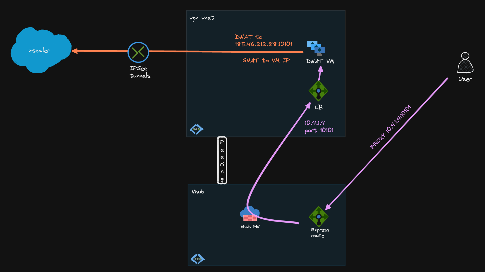
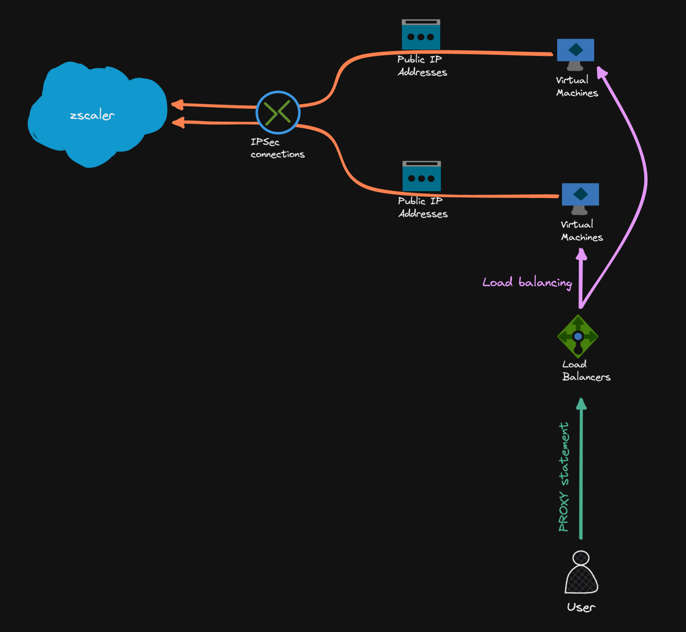

# Zscaler Tunnels on Azure - Part 2 - Linux IPSec

In my [last post](az-zscaler-vpngw.md){target="_blank"}, I created a IPSec tunnel to Zscaler using Azure VPN Gateway. Unfortunately, this setup does not work in a Virtual WAN environment, because [:octicons-link-external-16: spoke Vnets can't have Vnet gateways](https://learn.microsoft.com/en-us/azure/virtual-wan/virtual-wan-faq#can-a-spoke-vnet-have-a-virtual-network-gateway){target="_blank"}. Using VWAN VPN Gateways would make the VPN tunnel a branch, which is not what we need (I also want to avoid routing Public IPs internally).

Another option would be to use the Linux server to do the DNAT and IPSec tunnel, so this is what we will explore here.

<!-- more -->

## Target Setup



## Prerequisites

- Necessary Azure resources: RG, Vnet, Subnet,...
- Linux server with a public IP
- For multiple servers, each server needs it's own public IP attached, Public Azure load balancer does not work
- Zscaler VPN prerequisites (Static IP, VPN Credentials (PSK), Location)
- NSG to open UDP ports `500`, `4500` from the internet
- IP Forwarding enabled for the VM NIC resource

Note: Port `10101` is a Zscaler Dedicated Proxy Port (DPP)[^5], but also all other available Zscaler ports[^6] (e.g. 80, 443, 9400, 9480 and 9443) can be used

## IPSec on Linux

There are multiple options for building IPSec tunnels in Linux: e.g. [:octicons-link-external-16: Libreswan](https://libreswan.org/){target="_blank"}, [:octicons-link-external-16: Strongswan](https://www.strongswan.org/){target="_blank"}, [:octicons-link-external-16: Openswan](https://openswan.org/){target="_blank"}

For no particular reason, we will build the site-to-site tunnel with Libreswan[^4] in this example.

```bash
sudo apt install libreswan -y
```

```bash
sudo ipsec verify

Verifying installed system and configuration files

Version check and ipsec on-path                   	[OK]
Libreswan 3.32 (netkey) on 5.15.0-1034-azure
Checking for IPsec support in kernel              	[OK]
 NETKEY: Testing XFRM related proc values
         ICMP default/send_redirects              	[OK]
         ICMP default/accept_redirects            	[OK]
         XFRM larval drop                         	[OK]
Pluto ipsec.conf syntax                           	[OK]
Checking rp_filter                                	[OK]
Checking that pluto is running                    	[OK]
 Pluto listening for IKE on udp 500               	[OK]
 Pluto listening for IKE/NAT-T on udp 4500        	[OK]
 Pluto ipsec.secret syntax                        	[OK]
Checking 'ip' command                             	[OK]
Checking 'iptables' command                       	[OK]
Checking 'prelink' command does not interfere with FIPS	[OK]
Checking for obsolete ipsec.conf options          	[OK]
```

### Linux sysctl Settings

```bash
# /etc/sysctl.d/99-dnat.conf
net.ipv4.ip_forward=1
net.ipv6.conf.all.forwarding=1
net.ipv4.conf.*.accept_redirects = 0
net.ipv4.conf.*.send_redirects = 0
net.ipv6.conf.all.accept_redirects = 0
net.ipv6.conf.default.accept_redirects = 0
net.ipv4.ip_local_port_range=2048 65535
```

`net.ipv4.ip_local_port_range=2048 65535` extends the standard SNAT port range (~28000 ports on Ubuntu 22.04) to prevent SNAT port exhaustion[^3]

### Set PSK

After that, set the PSK to be used for the tunnel:

```bash
# /etc/ipsec.d/zscaler.secrets
# to use only one PSK for all connections:
%any %any : PSK "$sCAkcUwe434DwK4c54qBLw9H8G"

# to use the PSK for the connection to fra4-vpn.zscaler.net only:
fra4-vpn.zscaler.net : PSK "$sCAkcUwe434DwK4c54qBLw9H8G"
```

### Tunnel Basics

[:octicons-link-external-16: Libreswan ipsec.conf settings](https://libreswan.org/man/ipsec.conf.5.html){target="_blank"}

[:octicons-link-external-16: Libreswan configuration examples](https://libreswan.org/wiki/Configuration_examples){target="_blank"}

[:octicons-link-external-16: Zscaler IPSec parameters](https://help.zscaler.com/zia/understanding-ipsec-vpns#ikev2-supported-parameters){target="_blank"}

[:octicons-link-external-16: Zscaler Global Public Service Edge](https://help.zscaler.com/zia/about-global-zscaler-enforcement-nodes){target="_blank"}

!!! important
    `leftid` needs to be set to the VM public IP (this one should also be added to Zscaler Static IPs[^1])

### Route-based VPN

- [x] Creates tunnel interface `vti0`
- [x] A route-based VPN advertises `0.0.0.0/0` on both sides
- [x] Disables `vti-routing` because we don't want to route `0.0.0.0/0` into the tunnel
- [x] Marks the traffic - this mark could be used in `iptables` in `conntrack` rules
- [x] Only traffic directly routed into the tunnel will be forwarded that way
- [x] You need to manually add routes to route traffic into the tunnel: `ip route add 185.46.212.88 dev vti0`
- [x] Up/down script advantageous with `leftupdown` parameter to add/withdraw route according to `vti` state

``` bash hl_lines="8 10 12-13"
# /etc/ipsec.d/zscaler.conf
conn zscaler
    type=tunnel
    authby=secret
    auto=start
    left=%defaultroute
    leftid=45.123.234.123
    leftsubnet=0.0.0.0/0
    right=fra4-vpn.zscaler.net
    rightsubnet=0.0.0.0/0
    mark=5/0xffffffff
    vti-interface=vti0
    vti-routing=no
    ikev2=yes
    ike=aes256-sha2_256;dh14
    ikelifetime=86400s
    dpdaction=restart
    dpdtimeout=20s
    dpddelay=25s
    nat-keepalive=yes
    phase2=esp
    esp=null-md5
    salifetime=28800s
```

!!! tip
    In general, route-based vpn tunnels should be preferred to policy-based vpn tunnels. 
    
    For example, route-based tunnels allow you to run routing protocols over the VPN connection. A very good article about the different types [:octicons-link-external-16: here](https://weberblog.net/route-vs-policy-based-vpn-tunnels/)

### Policy-based VPN

With policy-based VPNs, an IPSec policy is created to route destination `185.46.212.88` into the tunnel:

No `vti` is created, no adding/removing routes in the routing table

Configuration:

``` bash hl_lines="8 10"
# /etc/ipsec.d/zscaler.conf
conn zscaler
    type=tunnel
    authby=secret
    auto=start
    left=%defaultroute
    leftid=45.123.234.123
    leftsubnet=0.0.0.0/0
    right=fra4-vpn.zscaler.net
    rightsubnet=185.46.212.88/32
    mark=5/0xffffffff
    ikev2=yes
    ike=aes256-sha2_256;dh14
    ikelifetime=86400s
    dpdaction=restart
    dpdtimeout=20s
    dpddelay=25s
    nat-keepalive=yes
    phase2=esp
    esp=null-md5
    salifetime=28800s
```
Check IPSec policy and state:

```sh
# state
sudo ip xfrm state

src 165.225.112.12 dst 10.4.1.4
	proto esp spi 0x3711f91f reqid 16389 mode tunnel
	replay-window 32 flag af-unspec
	auth-trunc hmac(md5) 0x3b2c9faf94007bc1efc94ca796b37d37 96
	enc ecb(cipher_null)
	encap type espinudp sport 4500 dport 4500 addr 0.0.0.0
	anti-replay context: seq 0x3, oseq 0x0, bitmap 0x00000007
src 10.4.1.4 dst 165.225.112.12
	proto esp spi 0x5f1e1fd1 reqid 16389 mode tunnel
	replay-window 32 flag af-unspec
	auth-trunc hmac(md5) 0x18bd5dd32c12a72a4c2f5288ab287fe0 96
	enc ecb(cipher_null)
	encap type espinudp sport 4500 dport 4500 addr 0.0.0.0
	anti-replay context: seq 0x0, oseq 0x3, bitmap 0x00000000

# policy
sudo ip xfrm pol

src 0.0.0.0/0 dst 185.46.212.88/32
	dir out priority 2097086
	tmpl src 10.4.1.4 dst 165.225.112.12
		proto esp reqid 16389 mode tunnel
src 185.46.212.88/32 dst 0.0.0.0/0
	dir fwd priority 2097086
	tmpl src 165.225.112.12 dst 10.4.1.4
		proto esp reqid 16389 mode tunnel
src 185.46.212.88/32 dst 0.0.0.0/0
	dir in priority 2097086
	tmpl src 165.225.112.12 dst 10.4.1.4
		proto esp reqid 16389 mode tunnel
<...>
```

### Enable the Tunnel

```bash
# enable and start service
sudo systemctl enable ipsec.service

sudo systemctl start ipsec.service

# tail -f service logs
journalctl -u ipsec -f

# successful conneciton
pluto[1297]: listening for IKE messages
pluto[1297]: Kernel supports NIC esp-hw-offload
pluto[1297]: adding interface eth0/eth0 (esp-hw-offload not supported by kernel) 10.
pluto[1297]: adding interface eth0/eth0 10.4.1.4:4500
pluto[1297]: adding interface lo/lo (esp-hw-offload not supported by kernel) 127.0.
pluto[1297]: adding interface lo/lo 127.0.0.1:4500
pluto[1297]: adding interface lo/lo (esp-hw-offload not supported by kernel) [::1]
pluto[1297]: loading secrets from "/etc/ipsec.secrets"
pluto[1297]: loading secrets from "/etc/ipsec.d/zscaler.secrets"
pluto[1297]: "zscaler" #1: initiating IKEv2 IKE SA
pluto[1297]: "zscaler": local IKE proposals (IKE SA initiator selecting KE):
pluto[1297]: "zscaler":   1:IKE=AES_CBC_256-HMAC_SHA2_256-HMAC_SHA2_256_128-MODP2048
pluto[1297]: "zscaler" #1: STATE_PARENT_I1: sent v2I1, expected v2R1
pluto[1297]: "zscaler": local ESP/AH proposals (IKE SA initiator emitting ESP/AH 
pluto[1297]: "zscaler":   1:ESP=NULL-HMAC_MD5_96-NONE-DISABLED
pluto[1297]: "zscaler" #2: STATE_PARENT_I2: sent v2I2, expected v2R2 {auth=IKEv2 8 prf=HMAC_SHA2_256 group=MODP2048}
pluto[1297]: "zscaler" #2: IKEv2 mode peer ID is ID_IPV4_ADDR: '165.225.112.12'
pluto[1297]: "zscaler" #2: Authenticated using authby=secret
pluto[1297]: "zscaler" #2: negotiated connection [0.0.0.0-255.255.255.255:0-65535 5 0]
pluto[1297]: "zscaler" #2: STATE_V2_IPSEC_I: IPsec SA established tunnel mode {ESP/NAT=>0x6d394066 <0xb319ec97 xfrm=NULL-HMAC_MD5_96 NATOA=none NATD=165.225.112.12:4500 DPD=active}
```

### Troubleshooting IPSec Tunnels

```bash
sudo journalctl -u ipsec 

sudo ipsec whack --status
sudo ipsec whack --trafficstatus

sudo ip tunnel show


# capture IPSec traffic only
sudo tcpdump -ni eth0 esp or udp port 500 or udp port 4500

# capture vti traffic (route-based)
sudo tcpdump -ni vti0
```

## DNAT/SNAT

```bash
sudo iptables -t nat -A PREROUTING -p tcp -i eth0 --dport 10101 -j DNAT --to-destination 185.46.212.88:10101
sudo iptables -t nat -A POSTROUTING -d 185.46.212.88 -j MASQUERADE

# make iptables rules persistent
# non-interactive mode, saves currently applied rules
echo iptables-persistent iptables-persistent/autosave_v4 boolean true | debconf-set-selections
echo iptables-persistent iptables-persistent/autosave_v6 boolean true | debconf-set-selections
sudo apt install iptables-persistent -y

# list iptables rules of the NAT table:
sudo iptables -nvL -t nat
```

The following happens here (example for route-based VPN):

Incoming packet on `eth0` - `10.4.1.4` on port `10101` (internal PAC file `return "PROXY 10.4.1.4:10101"` statement)

```
source: 10.8.0.4:56780
destination: 10.4.1.4:10101 (eth0)
```

First `iptables` rule changes the destination to the remote tunnel IP (DNAT, `PREROUTING` chain)

```
source: 10.8.0.4:56780
destination: 185.46.212.88:10101 (remote VPN side)
```

!!! info
    Forwarding decision is taken here -> destination interface is `vti0` according to the routing table (that's why we need to set the route)

Second rule masquerades (SNATs, `POSTROUTING` chain) the packet behind the local interface (`eth0`) IP

```
source: 10.4.1.4:43210 (eth0)
destination: 185.46.212.88:10101 (remote VPN side)
```

Forward the packet into the VPN tunnel (out `vti0` interface)

Conntrack[^2] will keep track of the mapping of original and translated source/destination `IP:port` tuples

!!! note
    This is the bare minimum `iptables` config and uses only NAT features. For an architectue deep dive for iptables check [:octicons-link-external-16: here](https://www.digitalocean.com/community/tutorials/a-deep-dive-into-iptables-and-netfilter-architecture){target="_blank"}

## HA

We can only use an internal Azure load balancer, and each VM needs its own public IP. 

In this setup, each server builds its own tunnels to Zscaler, and the load balancer distributes load from clients to the backend VMs. Both servers and the public IP resources should be allocated in different Availability Zones.

On the ILB, set up a load balancing rule for TCP port `10101` to the backend VMs. Return the ILB frontend IP in the PAC file statement for the clients. Azure Load balancer will never SNAT, so client IPs are visible on the backend VMs (e.g. for `tcpdump` to capture)



## Netdata Libreswan Monitoring

As a bonus, Netdata can natively monitor Libreswan tunnels uptime and bytes in/out

[:octicons-link-external-16: https://learn.netdata.cloud/docs/data-collection/monitor-anything/Networking/Libreswan-IPSec-tunnels](https://learn.netdata.cloud/docs/data-collection/monitor-anything/Networking/Libreswan-IPSec-tunnels){target="_blank"}

Add the netdata user to `/etc/sudoers.d/` to allow monitoring commands:

```bash
# /etc/sudoers.d/netdata
netdata ALL = (root) NOPASSWD: /sbin/ipsec whack --status
netdata ALL = (root) NOPASSWD: /sbin/ipsec whack --trafficstatus

# chmod the file
sudo chmod 600 etc/sudoers.d/netdata
```

## Costs

!!! example "Example Costs"

    VM: `Standard_D2sv3` ~$90/month

    LB: SKU `Standard` ~25/month with 1TB traffic forwarding

---

[^1]: [:octicons-link-external-16: Self-Provisioning of Static IP Addresses](https://help.zscaler.com/zia/self-provisioning-static-ip-addresses){target="_blank"}
[^2]: [:octicons-link-external-16: Connection Tracking (conntrack): Design and Implementation Inside Linux Kernel](https://arthurchiao.art/blog/conntrack-design-and-implementation/){target="_blank"}
[^3]: [:octicons-link-external-16: Conntrack tales - one thousand and one flows](https://blog.cloudflare.com/conntrack-tales-one-thousand-and-one-flows/){target="_blank"}
[^4]: [:octicons-link-external-16: IPSec based VPN using Libreswan](https://libreswan.org/wiki/images/a/a5/DevConf2016-IPsec.pdf){target="_blank"}
[^5]: [:octicons-link-external-16: Configuring Dedicated Proxy Ports](https://help.zscaler.com/zia/configuring-dedicated-proxy-ports){target="_blank"}
[^6]: [:octicons-link-external-16: Writing a PAC File](https://help.zscaler.com/zia/writing-pac-file#return-statements){target="_blank"}