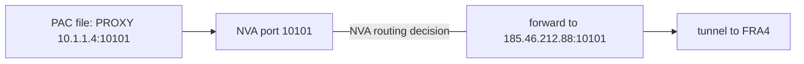
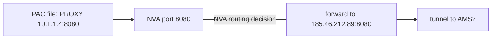
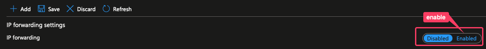
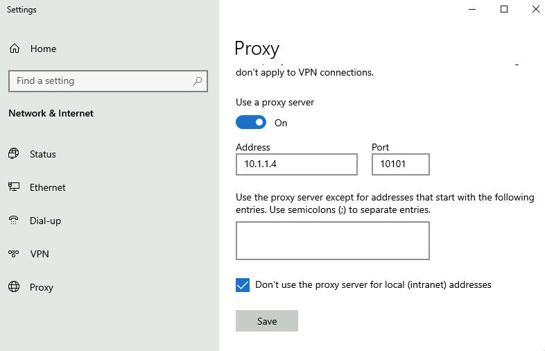
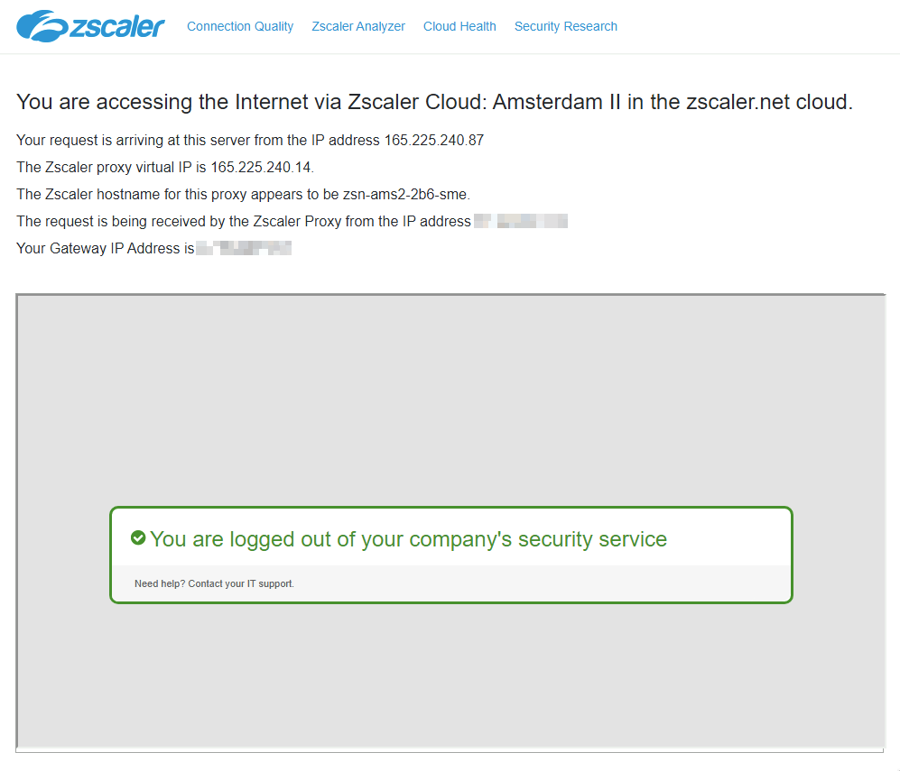

# Zscaler Tunnels on Azure - Part 1 - VPN Gateway

This post will look at how to build IPSec tunnels to Zscaler on Azure with Azure VPN Gateway. The complete Lab setup including notes is available [:octicons-link-external-16: here](https://github.com/joxz/lab-az/tree/main/vpngw-zscaler) as bicep files with additional notes and outputs.

The target setup should provide the options to forward traffic to the Zscaler tunnels in a default route and non-default route environment.
<!-- more -->


## Lab files

Lab Notes [:octicons-link-external-16: here](https://github.com/joxz/lab-az/tree/main/vpngw-zscaler)

The lab can be deployed with the following command:

```sh
# dry run
az deployment sub what-if --location 'westeurope' --template-file main.bicep

# deploy
az deployment sub create --location 'westeurope' --template-file main.bicep
```

Components that will be deployed:

- Resource Group
- 2 Vnets (gateway and spoke)
- VPN Gateway with 2 local network gateways building tunnels to Zscaler locations Frankfurt and Amsterdam
- Bastion
- Test VMs in both subnets (Linux VM in gw subnet, Windows VM in spoke subnet)
- VMSS for DNAT with a load balancer in front

## Tunnel and Zscaler config

### VPN Gateway

IKEv2 parameters used (for Phase 2 AES IPSec encryption an extra license is needed[^1]):

```powershell
  connectionMode: 'Default'
  connectionProtocol: 'IKEv2'
  connectionType: 'IPsec'
  dpdTimeoutSeconds: 20
  ipsecPolicies: [
    {
      dhGroup: 'DHGroup2'
      ikeEncryption: 'AES256'
      ikeIntegrity: 'SHA256'
      ipsecEncryption: 'None'
      ipsecIntegrity: 'SHA256'
      pfsGroup: 'None'
      saDataSizeKilobytes: 102400000
      saLifeTimeSeconds: 28800
    }
  ]
```

Full config: [:octicons-link-external-16: vpngw.bicep](https://github.com/joxz/lab-az/blob/main/vpngw-zscaler/vpngw.bicep)

### Zscaler

The following needs to be created in the Zscaler portal:

 - Static IPs (VPN gateway public IPs)
 - VPN Credentials
 - Location (static IPs and VPN credentials need to be referenced here)


## Default Route Environment

You cannot configure `0.0.0.0/0` on the local network gateway, but the default route range can be divided into two prefixes that work: `0.0.0.0/1`, `128.0.0.0/1`. This will also be preferred over the system route for `0.0.0.0/0` to the internet because it's more specific. All traffic will be forwarded to the VPN Gateway

```sh
az network nic show-effective-route-table -n nic-vm-sp -g rg-zsc-vpngw -o table

Source                 State    Address Prefix    Next Hop Type          Next Hop IP
---------------------  -------  ----------------  ---------------------  -------------
Default                Active   10.8.0.0/16       VnetLocal
Default                Active   10.1.0.0/16       VNetPeering
VirtualNetworkGateway  Active   0.0.0.0/1         VirtualNetworkGateway  10.1.0.6
VirtualNetworkGateway  Active   0.0.0.0/1         VirtualNetworkGateway  10.1.0.7
VirtualNetworkGateway  Active   128.0.0.0/1       VirtualNetworkGateway  10.1.0.6
VirtualNetworkGateway  Active   128.0.0.0/1       VirtualNetworkGateway  10.1.0.7
Default                Active   0.0.0.0/0         Internet
```

For peered Vnets, the option `Use the remote virtual network's gateway or Route Server` needs to be active for the VPN routes to be advertised

## Non-Default Route Environment

In this setup, the [:octicons-link-external-16: Zscaler Global Public Service Edge](https://help.zscaler.com/zia/about-global-zscaler-enforcement-nodes) IPs will be announced on the local network gateway. Those are anycast IPs advertised in every Zscaler datacenter. 

Also, some form of DNAT is needed - either with a NVA firewall appliance (e.g. Fortigate) or a Linux NVA with iptables DNAT. The client IP will not be preserved with DNAT and only NVA IPs be visible in the Zscaler logs.

### Linux NVA

DNAT/SNAT on Linux can easily be enabled with `iptables`. Packets reaching the NVA on a specific port (e.g. `10101` for a Zscaler Dedicated Proxy Port [^2] or ports `80`, `443` )

#### Working Linux settings

!!! note 
    This configuration will not survive a reboot

```bash
echo 1 > /proc/sys/net/ipv4/ip_forward
iptables -t nat -A PREROUTING -p tcp -i eth0 --dport 10101 -j DNAT --to-destination 185.46.212.88:10101
iptables -t nat -A POSTROUTING -d 185.46.212.88 -j MASQUERADE
```
!!! info
    The first `iptables` rule changes the destination IP, the second rule changes the source IP to the VM NIC

There is a lot more room to make the config more versatile, e.g. announce one Zscaler anycast IP per tunnel and use different ingress ports on the NVA. This way, traffic could be steered to the preferred tunnel via PAC file:





!!! tip
    A PAC file also supports multiple proxy assignments, e.g. `#!js return "PROXY 10.1.1.4:10101; PROXY 10.1.1.4:10102; DIRECT"`, so resiliency is not a problem.

    In this example, if the first proxy node is not reachable, it will fall back to the second one; if that's not reachable, traffic will go direct

If SNAT port exhaustion is an issue, the `net.ipv4.ip_local_port_range` setting (see: [:octicons-link-external-16: here](https://github.com/joxz/lab-az/tree/main/vpngw-zscaler#snat-ports)) should be adjusted, or multiple ip addresses can be assigned to a NIC in Azure [^4]

#### NVA Provisioning

The Linux NVAs don't need much config, they are basically just a NAT gateway. However, to make the configuration easy and persistent across reboots, the VM can be provisioned with the correct settings with `cloud-init`[^3]

`cloud-init` scripts can be added to Azure VMs during creation with the --custom-data switch (e.g. Lab repo [:octicons-link-external-16: vmss.bicep](https://github.com/joxz/lab-az/blob/main/vpngw-zscaler/vmss.bicep#L105))

Sample `cloud-config.yml`:

```yaml
#cloud-config
package_upgrade: true
runcmd:
  - echo 1 > /proc/sys/net/ipv4/ip_forward
  - echo 1 > /proc/sys/net/ipv6/conf/all/forwarding
  - iptables -t nat -A PREROUTING -p tcp -i eth0 --dport 10101 -j DNAT --to-destination 185.46.212.88:10101 -m comment --comment "forward port 10101 traffic to zscaler"
  - iptables -t nat -A POSTROUTING -d 185.46.212.88 -j MASQUERADE -m comment --comment "snat traffic to zscaler"
  - echo iptables-persistent iptables-persistent/autosave_v4 boolean true | debconf-set-selections
  - echo iptables-persistent iptables-persistent/autosave_v6 boolean true | debconf-set-selections
  - apt install iptables-persistent -y
  - wget -O /tmp/netdata-kickstart.sh https://my-netdata.io/kickstart.sh && sh /tmp/netdata-kickstart.sh --non-interactive
write_file:
  - path: /etc/sysctl.conf
    content: |
      net.ipv4.ip_forward=1
      net.ipv6.conf.all.forwarding=1
      net.ipv4.conf.all.accept_redirects = 0
      net.ipv4.conf.all.send_redirects = 0
    append: true
```

The config file will enable IP forwarding, set the `iptables`rules and make those persistent across reboots. Also, [:octicons-link-external-16: Netdata](https://github.com/netdata/netdata) will be installed for monitoring and is available at: `http://<VMIP>:19999`

IP forwarding also needs to be enabled on the network interface resource in Azure:



#### NVA as VMSS

The Linux NVA can also be deployed as a VMSS, with that we can achieve scalability (manual or autoscaling) and resiliency by placing instances in different AZs (see: [:octicons-link-external-16: vmss.bicep#zones](https://github.com/joxz/lab-az/blob/main/vpngw-zscaler/vmss.bicep#L84)). For load balancing the VMSS, Azure Load Balancer will be used (see: [:octicons-link-external-16: vmss.bicep#ilb resource](https://github.com/joxz/lab-az/blob/main/vpngw-zscaler/vmss.bicep#L8))

!!! note
    Currently `cloud-init` settings can not be updated on a deployed VMSS with CLI or Powershell [^5], so updating VMSS instances with new settings is probably best done with an OS image gallery and updating the image.

### Test

- On spoke VM add the NVA IP as a proxy server:



- Check connectivity at `http://ip.zscaler.com`:



A packet capture on the NVA confirms the NAT is working:

```sh
jo@vm-gwsn:~$ tcpdump -i eth0 'port 10101' 

17:53:16.490228 IP 185.46.212.88.10101 > 10.1.1.4.57323: Flags [P.], seq 193959:193998, ack 2964, win 2113, length 39
17:53:16.490241 IP 10.1.1.4.10101 > 10.8.0.4.57323: Flags [P.], seq 193928:193959, ack 2964, win 2113, length 31
17:53:16.490244 IP 10.1.1.4.10101 > 10.8.0.4.57323: Flags [P.], seq 193959:193998, ack 2964, win 2113, length 39
17:53:16.490723 IP 10.8.0.4.57323 > 10.1.1.4.10101: Flags [P.], seq 2964:2999, ack 193928, win 2050, length 35
17:53:16.490723 IP 10.8.0.4.57323 > 10.1.1.4.10101: Flags [.], ack 193998, win 2050, length 0
17:53:16.490739 IP 10.1.1.4.57323 > 185.46.212.88.10101: Flags [P.], seq 2964:2999, ack 193928, win 2050, length 35
17:53:16.490743 IP 10.1.1.4.57323 > 185.46.212.88.10101: Flags [.], ack 193998, win 2050, length 0
17:53:16.490850 IP 10.8.0.4.57323 > 10.1.1.4.10101: Flags [P.], seq 2999:3038, ack 193998, win 2050, length 39
17:53:16.490853 IP 10.1.1.4.57323 > 185.46.212.88.10101: Flags [P.], seq 2999:3038, ack 193998, win 2050, length 39
17:53:16.495014 IP 185.46.212.88.10101 > 10.1.1.4.57323: Flags [.], ack 3038, win 2111, length 0
17:53:16.495027 IP 10.1.1.4.10101 > 10.8.0.4.57323: Flags [.], ack 3038, win 2111, length 0
17:53:16.543674 IP 10.8.0.4.57327 > 10.1.1.4.10101: Flags [P.], seq 3424:3463, ack 13642, win 2050, length 39
17:53:16.543702 IP 10.1.1.4.57327 > 185.46.212.88.10101: Flags [P.], seq 3424:3463, ack 13642, win 2050, length 39
```

## Costs

!!! example "Example Costs"

    VPN Gateway: SKU `VpnGw2AZ` ~$400/month + traffic

    VMSS: 2x `Standard_D2sv3` ~245/month (other VM instance sizes should be tested)

    LB: SKU `Standard` ~20/month

---

[^1]: [:octicons-link-external-16: Understanding IPSec VPNs](https://help.zscaler.com/zia/understanding-ipsec-vpns#ikev2-supported-parameters)
[^2]: [:octicons-link-external-16: Configuring Dedicated Proxy Ports](https://help.zscaler.com/zia/configuring-dedicated-proxy-ports)
[^3]: [:octicons-link-external-16: cloud-init support for virtual machines in Azure](https://learn.microsoft.com/en-us/azure/virtual-machines/linux/using-cloud-init)
[^4]: [:octicons-link-external-16: Assign multiple IP addresses to virtual machines using the Azure portal](https://learn.microsoft.com/en-us/azure/virtual-network/ip-services/virtual-network-multiple-ip-addresses-portal)
[^5]: [:octicons-link-external-16: Lab Notes - Linux NVA as VMSS](https://github.com/joxz/lab-az/tree/main/vpngw-zscaler#linux-nva-as-vmss)