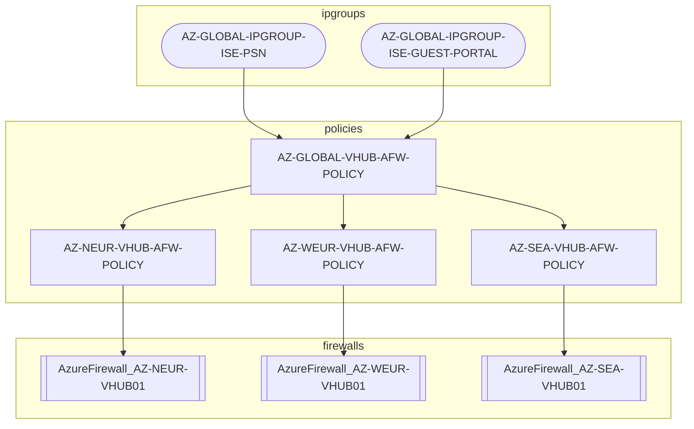
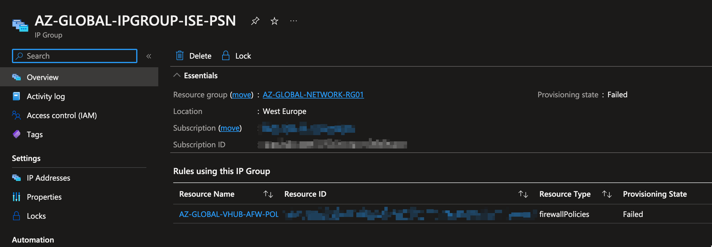
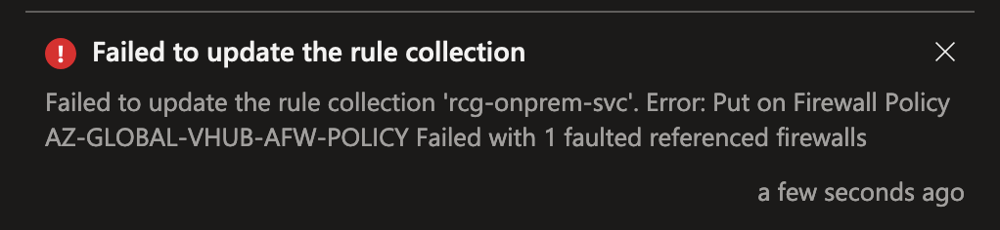
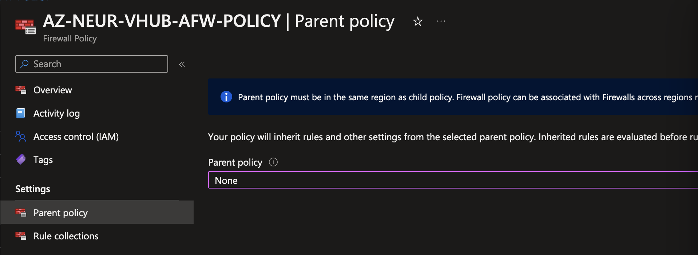
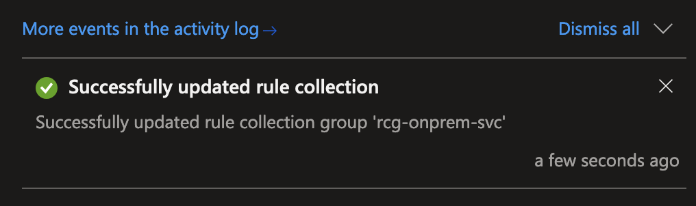
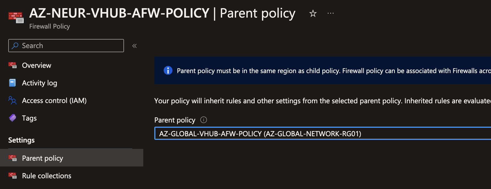

# Troubleshooting failed IP group that causes an AzureFirewall to fail

This is the documentation of a problem I encountered at work today, where updating an IP Group failed and caused the AzureFirewall policy associated with the IP Group to go into a 'Failed' state as well.

In my recent case, this happened in a parent/child policy setup. Traffic was still forwarded correctly by the AzureFirewall.

!!! info "Update Oct. 2023"
    This procedure also worked in cases where the parent policy (and one AzFW) failed without any ip group failures.

    General procedure:

    - Disconnect child from failed parent policy
    - `PUT` operation to get the AzFW in 'Succeeded' state
    - `PUT` operation to get the parent policy in 'Succeeded' state
    - If everyhting is in 'Succeeded' state, attach child to parent policy again

<!-- more -->

## Environment

- Azure Virtual WAN Standard
- Secure Virtual Hubs with AzureFirewall Premium
- Parent (`AZ-GLOBAL-VHUB-AFW-POLICY`) and child (`AZ-NEUR-VHUB-AFW-POLICY`) policy associated with Vhub AzFW (`AzureFirewall_AZ-NEUR-VHUB01`)
- IP groups used in network rule collections of parent policy




## Problem Description

When updating an IP Group with additional IP addresses, it somehow failed:



`AZ-GLOBAL-VHUB-AFW-POLICY` is the parent policy and utilizes IP Groups in 'Failed' state and is not modifyable anymore. Updates to rule collections fail with the error message: `Put on Firewall Policy AZ-GLOBAL-VHUB-AFW-POLICY Failed with 1 faulted referenced firewalls`



List of all IP Groups:

```
➜ az network ip-group list -o table

Location    Name                                ProvisioningState    ResourceGroup
----------  ----------------------------------  -------------------  ----------------------
westeurope  AZ-GLOBAL-IPGROUP-AGWS              Succeeded            AZ-GLOBAL-NETWORK-RG01
westeurope  AZ-GLOBAL-IPGROUP-AV                Succeeded            AZ-GLOBAL-NETWORK-RG01
westeurope  AZ-GLOBAL-IPGROUP-PRIVATEIPS        Succeeded            AZ-GLOBAL-NETWORK-RG01
westeurope  AZ-GLOBAL-IPGROUP-ISE-ALL           Succeeded            AZ-GLOBAL-NETWORK-RG01
westeurope  AZ-GLOBAL-IPGROUP-ISE-BCK           Succeeded            AZ-GLOBAL-NETWORK-RG01
westeurope  AZ-GLOBAL-IPGROUP-ISE-GUEST-PORTAL  Failed               AZ-GLOBAL-NETWORK-RG01
westeurope  AZ-GLOBAL-IPGROUP-ISE-MNT           Succeeded            AZ-GLOBAL-NETWORK-RG01
westeurope  AZ-GLOBAL-IPGROUP-ISE-PAN           Succeeded            AZ-GLOBAL-NETWORK-RG01
westeurope  AZ-GLOBAL-IPGROUP-ISE-PSN           Failed               AZ-GLOBAL-NETWORK-RG01
westeurope  AZ-GLOBAL-IPGROUP-ADDC-AZURE        Succeeded            AZ-GLOBAL-NETWORK-RG01
westeurope  AZ-GLOBAL-IPGROUP-ADDC-ONPREM       Succeeded            AZ-GLOBAL-NETWORK-RG01
```

List of all AzureFirewall resources:

```
➜ az network firewall list -o table

Location       Name                          ProvisioningState    ResourceGroup
-------------  ----------------------------  -------------------  ----------------------
northeurope    AzureFirewall_AZ-NEUR-VHUB01  Failed               az-global-network-rg01
westeurope     AzureFirewall_AZ-WEUR-VHUB01  Succeeded            AZ-GLOBAL-NETWORK-RG01
southeastasia  AzureFirewall_AZ-SEA-VHUB01   Succeeded            AZ-GLOBAL-NETWORK-RG01
```

List of all AzureFirewall policies:

```
➜ az network firewall policy list -o table

Location    Name                       ProvisioningState    ResourceGroup           ThreatIntelMode
----------  -------------------------  -------------------  ----------------------  -----------------
westeurope  AZ-GLOBAL-VHUB-AFW-POLICY  Failed               AZ-GLOBAL-NETWORK-RG01  Alert
westeurope  AZ-NEUR-VHUB-AFW-POLICY    Succeeded            AZ-GLOBAL-NETWORK-RG01  Alert
westeurope  AZ-WEUR-VHUB-AFW-POLICY    Succeeded            AZ-GLOBAL-NETWORK-RG01  Alert
westeurope  AZ-SEA-VHUB-AFW-POLICY     Succeeded            AZ-GLOBAL-NETWORK-RG01  Deny
```

!!! note
    `AZ-GLOBAL-VHUB-AFW-POLICY` (parent policy) and `AzureFirewall_AZ-NEUR-VHUB01` are failed, `AZ-SEA-VHUB-AFW-POLICY` (child policy) is succeeded

## Resolving the 'Failed' provisioning state for all resources

The main objective here should be to remove the failed IP Groups from the firewall policy and get all resources to 'Succeeded' provisioning state

### Disconnect parent policy from child policy associated with the failed AzFW resource

In our case, `AzureFirewall_NEUR-VHUB01` was the affected AzFW resource. 

`AZ-GLOBAL-VHUB-AFW-POLICY` was disconnected from `AZ-NEUR-VHUB-AFW-POLICY` as the parent policy



!!! danger "Important"
    The parent policy should now be modifyable again (Succeeded state)
    
    If the parent policy is still failed, a `PUT` operation[^1] can be used to get to 'Succeeded' state:

    ``` pwsh
    Get-AzFirewall -Name "AZ-GLOBAL-VHUB-AFW-POLICY" -ResourceGroupName "AZ-GLOBAL-NETWORK-RG01" | Set-AzFirewall
    ```

    In some cases this has to be done several times.

### Unconfigure failed IP Groups from Firewall Policy

To remove the problematic IP Groups from the policy, IP Groups were replaced with the respective IP addresses/prefixes.

This was successful, the failed IP Groups were not used anymore and the parent policy went into 'Succeeded' state



All resources - parent policy, child policy and firewall - should be in 'Succeeded' state by now

### Connect parent and child policy

The parent policy can now be associated to the child policy again



!!! important
    When re-connecting parent and child policy, different policy settings for TLS Inspection, IDPS, Threat Intelligence, DNS Proxy can cause the operation to fail. In this case, disconnect policies again, adjust settings, try again. I have not found an indicator or error message that could point me into the right direction to locate the problem here - I got it working through trial and error.

## Final Thoughts

I have to rethink if using IP Groups make sense to use. They seem to be a frequent cause of problems with firewall policies in my experience.

Grouping IPs and other objects in firewall policies is such an essential and basic feature that it shouldn't be the cause of any problems, ever. 


[^1]: [:octicons-link-external-16: Troubleshoot Azure Microsoft.Network failed provisioning state](https://learn.microsoft.com/en-us/azure/networking/troubleshoot-failed-state#microsoftnetworkazurefirewalls)