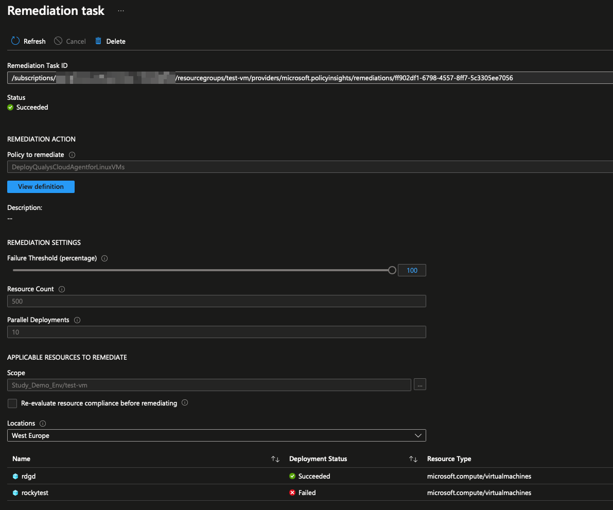

# Deploy Qualys Cloud Agent with Azure Policy

Qualys Cloud Agent is available as an Azure VM extension[^1]. This makes mass-deployment of the agent with Azure Policy very enjoyable. This post will go through the components of the `DeployIfNotExists` policy, remediation and troubleshooting.

[:simple-github: Github Repo Link](https://github.com/joxz/azure-policy/tree/main/vms/qualys){target="_blank"}

<!-- more -->

## Prerequisites

- [x] Qualys License Code
- [x] Windows and Linux Azure VMs for testing
- [x] Read how VM extensions for Windows[^2] and Linux[^3] work
- [x] Policy Definitions from the repo - [:simple-github:](https://github.com/joxz/azure-policy/tree/main/vms/qualys){target="_blank"}
- [x] Knowledge about ARM templates[^5] and `DeployIfNotExists` policies[^4]

Extension infos to be used in policies:

| | Windows | Linux |
| --- | --- | --- |
| Agent name/type | `QualysAgent` | `QualysAgentLinux` |
| Publisher | `Qualys` | `Qualys` |
| typeHandlerVersion | `3.1` | `1.6` | 
| autoUpgradeMinorVersion | `true` | `true` |

## Policy Definitions

The JSON definitions in the [:simple-github: Github Repo](https://github.com/joxz/azure-policy/tree/main/vms/qualys){target="_blank"} can be converted to Azure Policy Defintions with Powershell:

``` pwsh
New-AzPolicyDefinition -Name 'Policyname' -DisplayName 'Displayname of the policy' -Policy './difne-linux-qualys.json'
```


### Policy Evaluation

VMs can be tagged with `noqualysagent : true` to be ignored by this policy. The ignore tag key and value can be configured in policy parameters.

!!! info
    The `osType` VM property is evaluated for agent install, this should be filtered by the supported OS list[^6] from Qualys.

=== "Windows"
    ``` json hl_lines="9 14-15 18-19"
    "if": {
            "allOf": [
                {
                    "field": "type",
                    "equals": "Microsoft.Compute/virtualMachines"
                },
                {
                    "field": "Microsoft.Compute/virtualMachines/storageProfile.osDisk.osType",
                    "equals": "Windows"
                },
                {
                    "anyOf": [
                        {
                            "field": "[concat('tags[', parameters('excludetagname'), ']')]",
                            "exists": false
                        },
                        {
                            "field": "[concat('tags[', parameters('excludetagname'), ']')]",
                            "notEquals": "[parameters('excludetagvalue')]"
                        }
                    ]
                }
            ]
        }
    ```

=== "Linux"
    ```json hl_lines="9 14-15 18-19"
    "if": {
            "allOf": [
                {
                    "field": "type",
                    "equals": "Microsoft.Compute/virtualMachines"
                },
                {
                    "field": "Microsoft.Compute/virtualMachines/storageProfile.osDisk.osType",
                    "like": "Linux*"
                },
                {
                    "anyOf": [
                        {
                            "field": "[concat('tags[', parameters('excludetagname'), ']')]",
                            "exists": false
                        },
                        {
                            "field": "[concat('tags[', parameters('excludetagname'), ']')]",
                            "notEquals": "[parameters('excludetagvalue')]"
                        }
                    ]
                }
            ]
        }
    ```

### Policy Effect

Please read about the `DeployIfNotExists` policy effect and the properties used[^4]

With `existenceCondition` we can check for child resources of `Microsoft.Compute/virtualMachines`, such as `Microsoft.Compute/virtualMachines/extensions`. If the condition is met (i.e. the extension is already successfully installed), the ARM template deployment will be skipped.

`evaluationDelay` specifies the time after VM deployment until the policy triggers.

=== "Windows"
    ```json 
    "then": {
            "effect": "[parameters('effect')]",
            "details": {
                "type": "Microsoft.Compute/virtualMachines/extensions",
                "name": "QualysAgent",
                "roleDefinitionIds": [
                    "/providers/microsoft.authorization/roleDefinitions/9980e02c-c2be-4d73-94e8-173b1dc7cf3c"//(1)!
                ],
                "evaluationDelay": "AfterProvisioning",
                "existenceCondition": {
                    "allOf": [
                        {
                            "field": "Microsoft.Compute/virtualMachines/extensions/type",
                            "equals": "QualysAgent"
                        },
                        {
                            "field": "Microsoft.Compute/virtualMachines/extensions/publisher",
                            "equals": "Qualys"
                        },
                        {
                            "field": "Microsoft.Compute/virtualMachines/extensions/provisioningState",
                            "equals": "Succeeded"
                        }
                    ]
                },
                "deployment": {
                      ...
                }
            }
        }
    ```

    1. The property `roleDefinitionIds` is described [here](#managed-identity-and-rbac)

=== "Linux"
    ```json
    "then": {
            "effect": "[parameters('effect')]",
            "details": {
                "type": "Microsoft.Compute/virtualMachines/extensions",
                "name": "QualysAgentLinux",
                "roleDefinitionIds": [
                    "/providers/microsoft.authorization/roleDefinitions/9980e02c-c2be-4d73-94e8-173b1dc7cf3c"//(1)!
                ],
                "evaluationDelay": "AfterProvisioning",
                "existenceCondition": {
                    "allOf": [
                        {
                            "field": "Microsoft.Compute/virtualMachines/extensions/type",
                            "equals": "QualysAgentLinux"
                        },
                        {
                            "field": "Microsoft.Compute/virtualMachines/extensions/publisher",
                            "equals": "Qualys"
                        },
                        {
                            "field": "Microsoft.Compute/virtualMachines/extensions/provisioningState",
                            "equals": "Succeeded"
                        }
                    ]
                },
                "deployment": {
                      ...
                }
            }
        }
    ```

    1. The property `roleDefinitionIds` is described [here](#managed-identity-and-rbac)

### ARM Template Deployment

Qualys also provides an ARM template for agent deployment on [:simple-github: Github](https://github.com/Qualys/CloudAgent-Azure-ARMTemplate){target="_blank"}. That template can be slightly modified and used to deploy the agent with the policy.

=== "Windows"
    ```json
    "deployment": {
        "properties": {
            "mode": "incremental",
            "parameters": {//(1)!
                "vmName": {
                    "value": "[field('name')]"
                },
                "location": {
                    "value": "[field('location')]"
                },
                "licensecode": {
                    "value": "[parameters('licensecode')]"
                }
            },
            "template": {
                "$schema": "https://schema.management.azure.com/schemas/2015-01-01/deploymentTemplate.json#",
                "contentVersion": "1.0.0.0",
                "parameters": {
                    "vmName": {
                        "type": "string"
                    },
                    "location": {
                        "type": "string"
                    },
                    "licensecode": {
                        "type": "string"
                    }
                },
                "resources": [
                    {
                        "apiVersion": "2019-07-01",
                        "name": "[concat(parameters('vmName'), '/QualysAgent')]",//(2)!
                        "type": "Microsoft.Compute/virtualMachines/extensions",
                        "location": "[parameters('location')]",
                        "properties": {
                            "publisher": "Qualys",
                            "type": "QualysAgent",
                            "autoUpgradeMinorVersion": true,
                            "typeHandlerVersion": "3.1",
                            "settings": {
                                "LicenseCode": "[parameters('licensecode')]"
                            },
                            "protectedSettings": {}
                        }
                    }
                ]
            }
        }
    }
    ```

    1. Parameters passed from the policy to the ARM template
    2. The `name` property has to be `{vmName}/QualysAgent`. `vmName` will be passed by the policy through parameters (see [:simple-github: full policy definition](https://github.com/joxz/azure-policy/blob/main/vms/qualys/difne-win-qualys.json#L114){target="_blank"}) to the template

=== "Linux"
    ```json
    "deployment": {
        "properties": {
            "mode": "incremental",
            "parameters": {//(1)!
                "vmName": {
                    "value": "[field('name')]"
                },
                "location": {
                    "value": "[field('location')]"
                },
                "licensecode": {
                    "value": "[parameters('licensecode')]"
                }
            },
            "template": {
                "$schema": "https://schema.management.azure.com/schemas/2015-01-01/deploymentTemplate.json#",
                "contentVersion": "1.0.0.0",
                "parameters": {
                    "vmName": {
                        "type": "string"
                    },
                    "location": {
                        "type": "string"
                    },
                    "licensecode": {
                        "type": "string"
                    }
                },
                "resources": [
                    {
                        "apiVersion": "2019-07-01",
                        "name": "[concat(parameters('vmName'), '/QualysAgentLinux')]",//(2)!
                        "type": "Microsoft.Compute/virtualMachines/extensions",
                        "location": "[parameters('location')]",
                        "properties": {
                            "publisher": "Qualys",
                            "type": "QualysAgentLinux",
                            "autoUpgradeMinorVersion": true,
                            "typeHandlerVersion": "1.6",
                            "settings": {
                                "LicenseCode": "[parameters('licensecode')]"
                            },
                            "protectedSettings": {}
                        }
                    }
                ]
            }
        }
    }
    ```

    1. Parameters passed from the policy to the ARM template
    2. The `name` property has to be `{vmName}/QualysAgentLinux`. `vmName` will be passed by the policy through parameters (see [:simple-github: full policy definition](https://github.com/joxz/azure-policy/blob/main/vms/qualys/difne-linux-qualys.json#L114){target="_blank"}) to the template

## Policy Assignment

!!! warning "Important"
    After assigning the Policy Definition, the policy will evaluate newly created resources based on the defined criteria and deploy the agent if the conditions are met. Existing resources have to be remediated with a remediation task manually.

    Even when the extension is manually uninstalled after deployment, the policy will not remediate (reinstall the extension) automatically. A remediation task has to be used, the VM will be marked as non-compliant though

### Create the Policy Assignment

1. Create the assignment and set scope
2. Specify required parameters

3. Specify managed identity, don't create a remediation task yet


### Managed Identity and RBAC

`DeployIfNotExists` policies require a managed identity to be created. The managed identity is assigned the permissions defined in the `roleDefinitionIds` property.

In this case, `/providers/microsoft.authorization/roleDefinitions/9980e02c-c2be-4d73-94e8-173b1dc7cf3c` is the ID of the built-in `Virtual Machine Contributor` role, see [:octicons-link-external-16: AzRoleAdvertizer - Virtual Machine Contributor](https://www.azadvertizer.net/azrolesadvertizer/9980e02c-c2be-4d73-94e8-173b1dc7cf3c.html){target="_blank"}

RBAC custom roles can also be created and used, the minimum permissions needed are:

```
Microsoft.Resources/deployments/read
Microsoft.Resources/deployments/write 
Microsoft.Resources/deployments/validate/action
Microsoft.Resources/deployments/operations/read
Microsoft.Resources/deployments/operationstatuses/read

Microsoft.Compute/virtualMachines/extensions/read
Microsoft.Compute/virtualMachines/extensions/write
```

## Remediation Task

1. To remediate existing resources, create a remediation task. Choose the policy assignment to remediate:


2. The task should show the resources that need remediation on the bottom, if the evaluation has not happened, check the `Re-evaluate resource compliance before remediating`. The remediation task with re-evaluation enabled takes about ~15-30min longer to complete


3. When the task is completed, it shows succeeded and failed resources


## Deployment Success

- [x] Extension status is `Provisioning Succeeded`:


- [x] Server is visible in the Qualys Portal:


## Troubleshooting Deployment Errors

Deployment errors are displayed in the remediation task. In the example below, `Rocky Linux` is not supported by the agent. Besides not supported OS versions, VMs that are powered off will fail.


If encountering problems with the agent, you might want to take a look at the [agent logs](#agent-logs)
??? example "Example: Rocky Linux not supported"
    

    Checking the install script mentioned in the error message shows the following regex:

    

    The install script (`/var/lib/waagent/Qualys.QualysAgentLinux-1.6.1.4/bin/avme_install.sh`) will check for `/etc/redhat-release` and match to a regex. This regex does currently not include `Rocky Linux`. The problem will be fixed in December 2023 according to Qualys


## Deploy extension with AzCLI

List VM extensions available:

``` hl_lines="8 9"
➜ az vm extension image list --publisher Qualys --latest -o table

Name                              Publisher                      Version
--------------------------------  -----------------------------  ---------
QualysAgentGL                     Qualys.WindowsAgent.GrayLabel  1.0.0.2
LinuxAgent.AzureSecurityCenter    Qualys                         1.0.0.17
QualysAgentGL                     Qualys.LinuxAgent.GrayLabel    1.0.0.2
QualysAgent                       Qualys                         3.1.3.34
QualysAgentLinux                  Qualys                         1.6.1.4
WindowsAgent.AzureSecurityCenter  Qualys                         1.0.0.21
```

Install extension with AzCLI:

``` sh
➜ az vm extension set --publisher Qualys --name QualysAgentLinux --settings '{"LicenseCode": "LICENSECODE"}' --ids "/subscriptions/SUBSCRIPTIONID/resourceGroups/RGNAME/providers/Microsoft.Compute/virtualMachines/VMNAME"

{
  "autoUpgradeMinorVersion": true,
  "enableAutomaticUpgrade": null,
  "forceUpdateTag": null,
  "id": "/subscriptions/SUBSCRIPTIONID/resourceGroups/RGNAME/providers/Microsoft.Compute/virtualMachines/VMNAME/extensions/QualysAgentLinux",
  "instanceView": null,
  "location": "westeurope",
  "name": "QualysAgentLinux",
  "protectedSettings": null,
  "protectedSettingsFromKeyVault": null,
  "provisioningState": "Succeeded",
  "publisher": "Qualys",
  "resourceGroup": "RGNAME",
  "settings": {
    "LicenseCode": "LICENSECODE"
  },
  "suppressFailures": null,
  "tags": null,
  "type": "Microsoft.Compute/virtualMachines/extensions",
  "typeHandlerVersion": "1.6",
  "typePropertiesType": "QualysAgentLinux"
}
```

## Agent Logs

=== "Windows"
    Agent logs can be found in `C:\WindowsAzure\Logs\Qualys.QualysAgent\3.1.3.34\Asclog.txt`

    Agent installer is located in `C:\Packages\Plugins\Qualys.QualysAgent\3.1.3.34\`

=== "Linux"
    Agent Logs: `/var/log/qualys/qualys-cloud-agent.log`

    Extension Logs: `/var/log/azure/Qualys.QualysAgentLinux/lxagent.log`

    Install directory: `/usr/local/qualys/cloud-agent/bin`

    Install script: `/var/lib/waagent/Qualys.QualysAgentLinux-1.6.1.4/bin/avme_install.sh`

    Config files: `/etc/qualys/cloud-agent/`


[^1]: [:octicons-link-external-16: Azure virtual machine extensions and features](https://learn.microsoft.com/en-us/azure/virtual-machines/extensions/overview){target="_blank"}
[^2]: [:octicons-link-external-16: Virtual machine extensions and features for Windows](https://learn.microsoft.com/en-us/azure/virtual-machines/extensions/features-windows){target="_blank"}
[^3]: [:octicons-link-external-16: Virtual machine extensions and features for Linux](https://learn.microsoft.com/en-us/azure/virtual-machines/extensions/features-linux?tabs=azure-cli){target="_blank"}
[^4]: [:octicons-link-external-16: Understand Policy Effects](https://learn.microsoft.com/en-us/azure/governance/policy/concepts/effects#deployifnotexists){target="_blank"}
[^5]: [:octicons-link-external-16: What are ARM templates?](https://learn.microsoft.com/en-us/azure/azure-resource-manager/templates/overview){target="_blank"}
[^6]: [:octicons-link-external-16: Cloud Agent Platform Availability Matrix](https://success.qualys.com/support/s/article/000006675){target="_blank"}